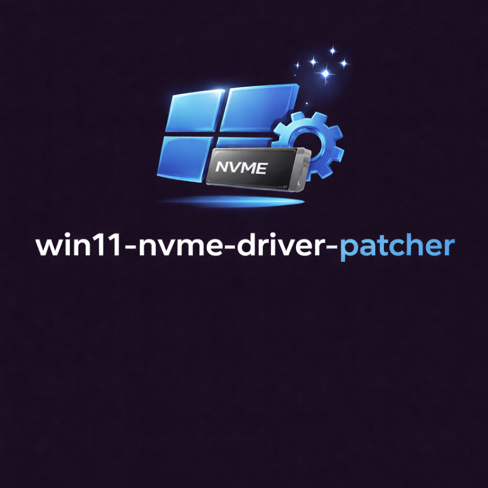
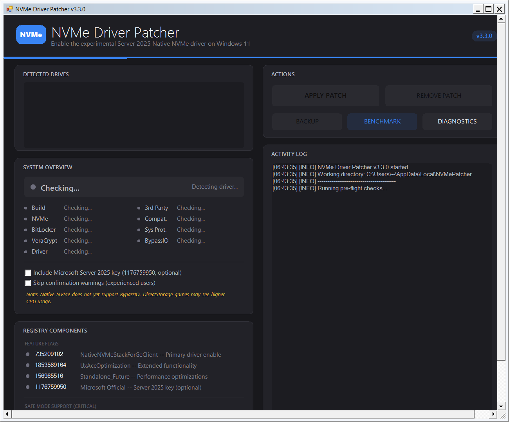

<!-- codex-branding:start -->
<p align="center"></p>

<p align="center">
  
  
  
</p>
<!-- codex-branding:end -->

# NVMe Driver Patcher for Windows 11

A GUI + CLI tool to enable the experimental Windows Server 2025 Native NVMe driver (nvmedisk.sys) on Windows 11, replacing the legacy SCSI translation layer for improved NVMe performance.




## Quick Start

**One-line install** (Run as Administrator in PowerShell):

```powershell
irm https://github.com/SysAdminDoc/win11-nvme-driver-patcher/releases/latest/download/NVMe_Driver_Patcher.ps1 -OutFile NVMe_Driver_Patcher.ps1; .\NVMe_Driver_Patcher.ps1
```

Or download `NVMe_Driver_Patcher.ps1` from [Releases](https://github.com/SysAdminDoc/win11-nvme-driver-patcher/releases) and right-click > **Run with PowerShell**.

## What Does This Do?

Windows Server 2025 introduced a new **Native NVMe driver** that eliminates the legacy SCSI translation layer, allowing direct communication with NVMe drives. This driver is available in Windows 11 (24H2+) but disabled by default. Microsoft has stated they are ["absolutely exploring"](https://techcommunity.microsoft.com/blog/windowsservernewsandbestpractices/announcing-native-nvme-in-windows-server-2025-ushering-in-a-new-era-of-storage-p/4477353) bringing it broadly to the entire Windows codebase.

**This tool enables it via 5 registry components:**

| Component | Purpose |
|-----------|---------|
| Feature Flag `735209102` | NativeNVMeStackForGeClient - Primary driver enable |
| Feature Flag `1853569164` | UxAccOptimization - Extended functionality |
| Feature Flag `156965516` | Standalone_Future - Performance optimizations |
| SafeBoot Minimal Key | Prevents INACCESSIBLE_BOOT_DEVICE BSOD in Safe Mode |
| SafeBoot Network Key | Safe Mode with Networking support |

Optional: Feature Flag `1176759950` (Microsoft Official Server 2025 key) can be included via checkbox. **Recommended** -- without it, the new I/O scheduler may not activate and results can be inconsistent.

> **Important:** The SafeBoot keys are critical. Without them, your system cannot boot into Safe Mode after enabling Native NVMe. Many manual guides omit these keys -- this tool includes them automatically.

## Features

**Safety & Compatibility**
- **VeraCrypt hard block** -- detects system encryption and refuses to patch ([breaks boot entirely](https://github.com/veracrypt/VeraCrypt/issues/1640))
- **Automatic BitLocker suspension** -- suspends BitLocker for one reboot cycle to prevent recovery key prompts
- **Comprehensive software detection** -- warns about Intel RST (BSOD risk), Intel VMD (boot failures), Hyper-V/WSL2 (40% I/O regression), Storage Spaces (array degradation), Veeam, Acronis, Macrium, Samsung Magician, WD Dashboard, Crucial Storage Executive, Data Deduplication
- **Laptop/power warning** -- detects laptops and warns about APST battery regression (~15% impact)
- **Rollback on partial failure** -- undoes all applied registry keys if patch doesn't complete fully
- **Registry backup** export + system restore point creation before any changes
- **Third-party driver detection** (Samsung, WD, Intel RST, AMD, SK Hynix, Crucial, Phison)
- **Recovery Kit generation** -- creates .reg + .bat files for offline WinRE recovery (auto-detects WinRE, loads offline registry hive)

**Diagnostics & Benchmarking**
- **Built-in DiskSpd benchmark** -- 4K random read/write test targeting NVMe drive with before/after comparison (auto-downloads [Microsoft DiskSpd](https://github.com/microsoft/diskspd))
- **11 async preflight checks** run in a background thread without freezing the GUI
- **NVMe health badges** -- temperature, wear %, firmware, power-on hours, media errors (hover for SMART details)
- **Per-drive NATIVE/LEGACY badges** -- shows whether each NVMe drive migrated to `nvmedisk.sys` or remains on `stornvme.sys`
- **Post-reboot drive migration verification** -- per-drive confirmation of which drives moved to "Storage disks"
- **BypassIO/DirectStorage** status check with gaming impact warning
- **Before/after comparison** -- shows exactly what changed after patch/unpatch
- **Diagnostics export** -- full system report with SMART health, compat software, migration status, benchmark history
- **GitHub update check** with clickable badge in title bar
- **Windows Event Log** integration for audit trails

**UI/UX**
- **WPF dark theme** -- zinc-950 palette with blue accent, custom title bar, drop shadow
- **Resizable window** with grip handle, clamped to work area (no off-screen at high DPI)
- **Toast notifications** -- Windows balloon tips for patch results
- **Activity log** with right-click context menu (Copy Selection, Select All, Copy All, Clear)
- **Collapsible Settings panel** -- Auto-save, Toasts, Event Log, Restart Delay, Open Data Folder
- **Benchmark IOPS display** in patch status card
- **Refresh button** -- re-run all preflight checks without restarting
- **Skip warnings checkbox** -- for experienced users who don't need confirmation dialogs
- **Silent/CLI mode** for scripting and automation

## CLI Usage

All CLI operations require Administrator privileges.

```powershell
# Check patch status (exit code: 0=applied, 1=not applied, 2=partial)
# Shows driver status, migration, compat warnings, laptop detection
.\NVMe_Driver_Patcher.ps1 -Silent -Status

# Apply the patch silently without restart prompt
.\NVMe_Driver_Patcher.ps1 -Silent -Apply -NoRestart

# Apply with force (skip NVMe drive check and preflight)
.\NVMe_Driver_Patcher.ps1 -Silent -Apply -Force

# Remove the patch silently
.\NVMe_Driver_Patcher.ps1 -Silent -Remove

# Export system diagnostics report
.\NVMe_Driver_Patcher.ps1 -ExportDiagnostics

# Generate post-reboot verification script
.\NVMe_Driver_Patcher.ps1 -GenerateVerifyScript

# Generate WinRE-compatible recovery kit
.\NVMe_Driver_Patcher.ps1 -ExportRecoveryKit
```

**Exit Codes (Silent Mode):**

| Code | Meaning |
|------|---------|
| 0 | Success / Patch Applied |
| 1 | Failure / Patch Not Applied |
| 2 | Partial / No NVMe drives |
| 3 | Invalid parameters |
| 4 | Elevation required |

## Requirements

| Requirement | Details |
|-------------|---------|
| **OS** | Windows 11 Build 22000+ (24H2 or 25H2 recommended) |
| **Privileges** | Administrator (auto-elevation prompt) |
| **Hardware** | NVMe SSD using Windows inbox driver (`StorNVMe.sys`) |
| **Update** | KB5066835 (October 2025 cumulative update) or newer |

## Windows Version Compatibility

| Windows 11 Version | Build | Support |
|--------------------|-------|---------|
| 25H2 | 26200+ | Full support, best performance |
| 24H2 | 26100 | Full support, recommended minimum |
| 23H2 | 22631 | Partial -- feature flags apply but driver may not activate |
| 22H2 | 22621 | Not recommended -- driver not present in base image |
| 21H2 | 22000 | Unsupported |

> The tool will warn you if your build is below 26100 but will not block the patch.

## Hardware Compatibility

The patch works with any NVMe drive using the Windows inbox `StorNVMe.sys` driver. Drives using vendor-specific drivers are unaffected.

**Confirmed working:**

| Brand | Models |
|-------|--------|
| Samsung | 970 Evo/Plus, 980, 980 Pro, 990 Pro (when using inbox driver) |
| WD | SN570, SN580, SN770, SN850X (when using inbox driver) |
| Crucial | P3, P3 Plus, P5, P5 Plus, T705 |
| SK Hynix | Platinum P41, Gold P31 |
| Kingston | NV2, KC3000 |
| Sabrent | Rocket 4 Plus |
| Solidigm | P5316 (enterprise, Server 2025 tested) |
| Generic/OEM | Any drive using StorNVMe.sys |

**Not compatible (uses vendor driver by default):**

| Brand | Notes |
|-------|-------|
| Samsung (with Samsung NVMe Driver) | Uses `samsungnvmedriver.sys` -- patch has no effect |
| WD (with WD Dashboard driver) | Uses proprietary driver |

To check which driver your drive uses: **Device Manager > Disk drives > [Your NVMe] > Properties > Driver > Driver Files**

## Performance Benchmarks

The native NVMe driver delivers significant gains by eliminating the SCSI translation layer. Results vary by SSD model, controller, and workload type.

### Independent Benchmark Results

| Source | Test | Improvement |
|--------|------|-------------|
| [Tom's Hardware](https://www.tomshardware.com/pc-components/ssds/new-windows-native-nvme-driver-benchmarks-reveal-transformative-performance-gains-up-to-64-89-percent-lightning-fast-random-reads-and-breakthrough-cpu-efficiency) | 4K random read (StorageReview) | **+64.89%** |
| [Tom's Hardware](https://www.tomshardware.com/pc-components/ssds/windows-11-rockets-ssd-performance-to-new-heights-with-hacked-native-nvme-driver-up-to-85-percent-higher-random-workload-performance-in-some-tests) | Random workloads (consumer SSD) | **Up to +85%** |
| [StorageReview](https://www.storagereview.com/review/windows-server-native-nvme) | 64K random read latency | **-38.46%** (faster) |
| [NotebookCheck](https://www.notebookcheck.net/Windows-11-hack-Higher-SSD-speeds-with-new-Microsoft-NVMe-driver.1190489.0.html) | Sequential read / write (PCIe 4.0) | +23% / +30% |
| [Microsoft](https://techcommunity.microsoft.com/blog/windowsservernewsandbestpractices/announcing-native-nvme-in-windows-server-2025-ushering-in-a-new-era-of-storage-p/4477353) | 4K random read IOPS (Server) | **+80%**, -45% CPU |
| [Overclock.net](https://www.overclock.net/threads/enable-native-nvme-driver-in-windows-11-24h2-25h2-with-last-update.1818467/) | IOPS 512b-8KB (Samsung OEM) | **+167%** |
| CrystalDiskMark (Reddit) | 4K-64Thrd random read/write | +22% / +85% |

### What to Expect

| Workload | Expected Gains |
|----------|---------------|
| Random 4K read/write (high queue depth) | **+20% to +85%** -- biggest wins |
| Sequential read/write | +10% to +30% |
| Desktop responsiveness (app launches, boot) | Noticeable improvement |
| Gaming (load times) | Minimal difference |
| DirectStorage games | **May be worse** (BypassIO not supported) |

> The biggest gains are in high-queue-depth random I/O. Sequential transfers and gaming see more modest improvements. Desktop usage operates at QD1-2 where gains are ~2%. Run your own benchmarks with the built-in DiskSpd or [CrystalDiskMark](https://crystaldiskmark.org/) before and after.

## Known Compatibility Issues

The tool automatically detects and warns about all of these. VeraCrypt is a hard block.

| Software | Issue | Severity | Auto-Detected |
|----------|-------|----------|---------------|
| **VeraCrypt** (system encryption) | [Breaks boot entirely](https://github.com/veracrypt/VeraCrypt/issues/1640) | **Critical** | Yes (blocks patch) |
| **BitLocker** | May trigger recovery key prompt | High | Yes (auto-suspends) |
| **Intel RST** | Conflicts with nvmedisk.sys, BSOD risk | High | Yes (warns) |
| **Intel VMD** | Boot failures on VMD-configured systems | High | Yes (warns) |
| **Hyper-V / WSL2** | WSL2 disk I/O ~40% slower (no paravirt) | Medium | Yes (warns) |
| **Storage Spaces** | Arrays may degrade or disappear | High | Yes (warns) |
| **Acronis True Image** | Drives invisible to backup/restore | High | Yes (warns) |
| **Veeam Backup** | Cannot detect drives | High | Yes (warns) |
| **Macrium Reflect** | May need update for compatibility | Medium | Yes (warns) |
| **Samsung Magician** | Cannot detect drives (SCSI pass-through) | Low | Yes (warns) |
| **WD Dashboard** | Cannot detect drives (SCSI pass-through) | Low | Yes (warns) |
| **Crucial Storage Executive** | Cannot detect drives (SCSI pass-through) | Low | Yes (warns) |
| **Data Deduplication** | Microsoft confirms incompatibility | High | Yes (warns) |
| **Laptop / Battery** | APST broken, ~15% battery life reduction | Medium | Yes (warns) |
| DirectStorage games | BypassIO not supported, higher CPU | Low-Medium | Yes (warns) |

If you experience problems, use the **Remove Patch** button (or `-Silent -Remove`) and restart.

## Recovery Kit

The tool can generate a **WinRE-compatible Recovery Kit** -- a folder containing:

- **`NVMe_Remove_Patch.reg`** -- double-click from Windows, or `regedit /s` from WinRE
- **`Remove_NVMe_Patch.bat`** -- smart batch script that auto-detects WinRE vs Windows, finds your Windows installation, loads the offline SYSTEM hive, and removes the patch from all ControlSets
- **`README.txt`** -- step-by-step instructions for both Windows and WinRE recovery

A recovery kit is **automatically generated** after each successful patch installation. You can also create one manually via the **RECOVERY KIT** button or `.\NVMe_Driver_Patcher.ps1 -ExportRecoveryKit`.

**Copy this folder to a USB drive** before rebooting to have an offline recovery option if the system won't boot.

## Scope

**This patch affects ALL NVMe drives** in your system that use the Windows inbox driver (`StorNVMe.sys`), not just the OS drive.

**Exception:** Drives using vendor-specific drivers (e.g., Samsung's proprietary driver) are not affected.

## Troubleshooting

### "No NVMe drives detected"
- Your drives may use vendor-specific drivers
- Check Device Manager > Disk drives > Properties > Driver
- If using Samsung/WD proprietary drivers, this patch won't help

### System won't boot after patch

**Option 1: Use the Recovery Kit (recommended)**
1. If you saved the Recovery Kit to USB before rebooting:
2. Boot to WinRE (hold Shift + Restart, or use Windows install USB > "Repair")
3. Open Command Prompt
4. Navigate to USB (try `D:`, `E:`, `F:`)
5. Run `NVMe_Recovery_Kit\Remove_NVMe_Patch.bat`
6. Restart

**Option 2: Manual WinRE removal**
1. Boot to WinRE > Troubleshoot > Advanced options > Command Prompt
2. Load the offline registry:
```cmd
reg load HKLM\OFFLINE C:\Windows\System32\config\SYSTEM
```
(If C: doesn't work, try D: or E: -- drive letters differ in WinRE)
3. Remove the patch:
```cmd
reg delete "HKLM\OFFLINE\ControlSet001\Policies\Microsoft\FeatureManagement\Overrides" /v 735209102 /f
reg delete "HKLM\OFFLINE\ControlSet001\Policies\Microsoft\FeatureManagement\Overrides" /v 1853569164 /f
reg delete "HKLM\OFFLINE\ControlSet001\Policies\Microsoft\FeatureManagement\Overrides" /v 156965516 /f
reg delete "HKLM\OFFLINE\ControlSet001\Policies\Microsoft\FeatureManagement\Overrides" /v 1176759950 /f
reg unload HKLM\OFFLINE
```
4. Restart

**Option 3: Wait for auto-recovery**
Windows automatically disables the native NVMe driver after 2-3 consecutive failed boots and reverts to the legacy stack.

### Can't boot into Safe Mode
This shouldn't happen if you used this tool (SafeBoot keys are included). If it does, follow the WinRE steps above.

### SSD vendor tools stopped working
Samsung Magician, WD Dashboard, and Crucial Storage Executive use legacy SCSI pass-through to communicate with drives. The native NVMe driver doesn't implement this interface. Use Windows built-in tools (Device Manager, `Get-PhysicalDisk`, `Get-StorageReliabilityCounter`) for health monitoring instead, or remove the patch to restore compatibility.

## Credits & Sources

- **Microsoft TechCommunity** -- [Announcing Native NVMe in Windows Server 2025](https://techcommunity.microsoft.com/blog/windowsservernewsandbestpractices/announcing-native-nvme-in-windows-server-2025-ushering-in-a-new-era-of-storage-p/4477353)
- **Tom's Hardware** -- [Native NVMe Driver Benchmarks: Up to 64.89% Gains](https://www.tomshardware.com/pc-components/ssds/new-windows-native-nvme-driver-benchmarks-reveal-transformative-performance-gains-up-to-64-89-percent-lightning-fast-random-reads-and-breakthrough-cpu-efficiency)
- **Tom's Hardware** -- [Up to 85% Higher Random Workload Performance](https://www.tomshardware.com/pc-components/ssds/windows-11-rockets-ssd-performance-to-new-heights-with-hacked-native-nvme-driver-up-to-85-percent-higher-random-workload-performance-in-some-tests)
- **StorageReview** -- [Windows Server 2025 Native NVMe Benchmarks](https://www.storagereview.com/review/windows-server-native-nvme)
- **NotebookCheck** -- [Higher SSD Speeds with New Microsoft NVMe Driver](https://www.notebookcheck.net/Windows-11-hack-Higher-SSD-speeds-with-new-Microsoft-NVMe-driver.1190489.0.html)
- **Ghacks** -- [This Registry Hack Unlocks a Faster NVMe Driver in Windows 11](https://www.ghacks.net/2025/12/26/this-registry-hack-unlocks-a-faster-nvme-driver-in-windows-11/)
- **XDA Developers** -- [Windows 11 Free NVMe Speed Boost](https://www.xda-developers.com/windows-11-nvme-owners-free-speed-boost-enable/)
- **Overclock.net** -- [Community Testing Thread](https://www.overclock.net/threads/enable-native-nvme-driver-in-windows-11-24h2-25h2-with-last-update.1818467/)
- **Win-Raid Level1Techs** -- [Native NVMe Discussion](https://winraid.level1techs.com/t/discussion-microsofts-native-nvme-disk-drive-support/113111)
- **VeraCrypt** -- [Issue #1640: Breaks boot with native NVMe driver](https://github.com/veracrypt/VeraCrypt/issues/1640)
- **4sysops** -- [Windows Server 2025 Native NVMe Support](https://4sysops.com/archives/windows-server-2025-introduces-native-nvme-support-with-performance-gains-of-up-to-80-percent/)
- **StarWind** -- [Windows Server 2025 Native NVMe Support](https://www.starwindsoftware.com/blog/windows-server-native-nvme-support/)
- **Thomas-Krenn Wiki** -- [Activation of Native NVMe Driver](https://www.thomas-krenn.com/en/wiki/Activation_of_native_NVME_driver_in_Windows_Server_2025)

## Disclaimer

This tool modifies system registry settings to enable an **experimental, unsupported** feature on Windows 11. While safety measures are included (VeraCrypt detection, BitLocker auto-suspend, restore points, registry backups, rollback on failure, recovery kit generation), use at your own risk. The native NVMe driver is only officially supported on Windows Server 2025. Always ensure you have backups before making system changes.

---

<p align="center">
  <b>Made with coffee by <a href="https://github.com/SysAdminDoc">SysAdminDoc</a></b>
</p>
